<div align="center">

<!-- Golden Ratio Typography: φ emphasis for educational excellence -->
<h1 style="font-size: 1.618em; color: #2c3e50; margin: 42px 0 26px 0;">
  🎓 SaaS School Management Platform
</h1>

<h3 style="font-size: 1.2em; color: #34495e; margin: 20px 0; max-width: 618px;">
  <em>Enterprise-Grade Educational Technology Solution with Golden Ratio Design Excellence</em>
</h3>

<!-- Golden Ratio Badge Layout: Primary Educational Technologies (61.8%) -->
<div style="margin: 32px 0;">
  
  
  
  
</div>

<!-- Supporting Technologies (38.2%) -->
<div style="margin: 20px 0;">
  
  
  
  
</div>

<!-- Status Badges with φ proportions -->
<div style="margin: 26px 0;">
  
  
  
  
  
</div>

</div>

---

## 🌟 **Platform Overview** ✨ *Golden Ratio Design (φ ≈ 1.618)*

<div align="center">

*Enterprise educational platform architecture following φ proportions for optimal learning experience*

</div>

### 🎯 **Multi-Tenant Educational Architecture - Golden Ratio Layout**

```mermaid
graph TB
    %% Golden Ratio Educational Layer (φ = 1.618 priority for schools)
    subgraph "🏫 Educational Institutions Layer - φ Priority"
        direction LR
        Schools[🏫 Schools Management<br/>Multi-Tenant Architecture<br/>φ Priority - 61.8%]
        Teachers[👨‍🏫 Teachers Portal<br/>Curriculum & Classes<br/>1.0 Priority - Balanced]
        Students[👨‍🎓 Students Platform<br/>Learning & Grades<br/>1/φ Priority - 38.2%]
        Parents[👨‍👩‍👧‍👦 Parents Portal<br/>Progress Tracking<br/>1/φ Priority - 38.2%]
    end
    
    %% Golden Ratio Gateway Layer (1.0 balanced processing)
    subgraph "🚪 API Gateway Layer - Balanced Processing"
        direction TB
        Gateway[⚡ Express.js Gateway<br/>Request Routing<br/>Load Balancing]
        Auth[🔐 JWT Authentication<br/>Multi-Tenant Security<br/>Role-Based Access]
        RateLimit[⏱️ Rate Limiting<br/>Traffic Control<br/>School Isolation]
        Swagger[📚 API Documentation<br/>200+ Endpoints<br/>Educational APIs]
    end
    
    %% Golden Ratio Services Layer (φ educational business logic)
    subgraph "⚙️ Educational Services Layer - φ Business Logic"
        direction TB
        
        subgraph "🎓 Core Educational Services"
            Scheduling[📅 AI Scheduling<br/>Smart Timetables<br/>φ Priority]
            Academic[📚 Academic Management<br/>Curriculum & Grades<br/>φ Priority]
            MultiTenant[🏫 Multi-Tenant Core<br/>School Isolation<br/>φ Priority]
        end
        
        subgraph "💬 Communication Services"
            Notification[🔔 Notification Hub<br/>Multi-Channel Alerts<br/>1.0 Priority]
            Payment[💳 Payment Gateway<br/>Global Processing<br/>1.0 Priority]
            Analytics[📊 Analytics Engine<br/>Educational Insights<br/>1/φ Priority]
        end
    end
    
    %% Golden Ratio Data Layer (1/φ = 0.618 persistence)
    subgraph "🗄️ Data Persistence Layer - φ Storage"
        direction LR
        PostgreSQL[(🐘 PostgreSQL Cluster<br/>Multi-Tenant Schema<br/>φ Write Load)]
        Redis[(⚡ Redis Cache<br/>Sessions & Performance<br/>38.2% Cache)]
        FileSystem[(📁 File Storage<br/>Documents & Media<br/>38.2% Files)]
    end
    
    %% Golden Spiral Communication Flow (Primary - 61.8%)
    Schools ==>|Primary Traffic<br/>φ Load| Gateway
    Teachers ==>|Curriculum Traffic<br/>Standard Load| Gateway
    Students -.->|Learning Traffic<br/>Background Load| Gateway
    Parents -.->|Progress Tracking<br/>Light Load| Gateway
    
    %% Gateway Processing (Balanced - 1.0)
    Gateway ==>|Request Processing| Auth
    Auth ==>|Authenticated Requests| RateLimit
    RateLimit ==>|Controlled Traffic| Scheduling
    RateLimit ==>|Controlled Traffic| Academic
    RateLimit ==>|Controlled Traffic| MultiTenant
    
    %% Educational Service Communication (φ distributed)
    Scheduling -.->|Class Assignments<br/>Service Mesh| Academic
    Academic -.->|Grade Updates<br/>Real-time Sync| Notification
    MultiTenant -.->|Tenant Context<br/>Isolation| Payment
    Payment -.->|Transaction Events<br/>Analytics| Analytics
    
    %% Data Layer Connections (φ distributed load)
    Scheduling ==>|Timetable Data<br/>φ Priority| PostgreSQL
    Academic ==>|Educational Records<br/>φ Priority| PostgreSQL
    MultiTenant ==>|Tenant Data<br/>φ Priority| PostgreSQL
    
    Gateway -.->|Session Management| Redis
    Auth -.->|Token Caching| Redis
    Notification -.->|Media Storage| FileSystem
    
    %% Golden Ratio Color Scheme (φ visual hierarchy)
    style Schools fill:#e74c3c,stroke:#c0392b,stroke-width:5px,color:#ffffff
    style Teachers fill:#3498db,stroke:#2980b9,stroke-width:4px,color:#ffffff
    style Students fill:#f39c12,stroke:#e67e22,stroke-width:3px,color:#ffffff
    style Parents fill:#95a5a6,stroke:#7f8c8d,stroke-width:2px,color:#ffffff
    
    style Gateway fill:#2c3e50,stroke:#1a252f,stroke-width:4px,color:#ffffff
    style Auth fill:#27ae60,stroke:#229954,stroke-width:4px,color:#ffffff
    style RateLimit fill:#8e44ad,stroke:#7d3c98,stroke-width:3px,color:#ffffff
    style Swagger fill:#16a085,stroke:#138d75,stroke-width:2px,color:#ffffff
    
    style Scheduling fill:#e74c3c,stroke:#c0392b,stroke-width:4px,color:#ffffff
    style Academic fill:#3498db,stroke:#2980b9,stroke-width:4px,color:#ffffff
    style MultiTenant fill:#27ae60,stroke:#229954,stroke-width:4px,color:#ffffff
    style Notification fill:#f39c12,stroke:#e67e22,stroke-width:3px,color:#ffffff
    style Payment fill:#9b59b6,stroke:#8e44ad,stroke-width:3px,color:#ffffff
    style Analytics fill:#34495e,stroke:#2c3e50,stroke-width:2px,color:#ffffff
    
    style PostgreSQL fill:#336791,stroke:#2d5aa0,stroke-width:5px,color:#ffffff
    style Redis fill:#DC382D,stroke:#c0392b,stroke-width:3px,color:#ffffff
    style FileSystem fill:#607d8b,stroke:#455a64,stroke-width:3px,color:#ffffff
```



### 🔄 **Educational Data Flow - Golden Ratio Communication**

<div align="center">

*Multi-tenant educational workflows optimized with φ proportions for efficient learning management*

```mermaid
sequenceDiagram
    participant S as 🏫 School Admin
    participant T as 👨‍🏫 Teacher
    participant St as 👨‍🎓 Student
    participant G as 🚪 API Gateway
    participant A as 🔐 Auth Service
    participant Sch as 📅 Scheduling
    participant Ac as 📚 Academic
    participant N as 🔔 Notifications
    participant D as 🗄️ Database
    
    Note over S,D: Golden Ratio Educational Flow (φ = 1.618 optimization)
    
    %% Primary Educational Flow (61.8% - φ priority)
    S->>+G: 1. Create Class Schedule<br/>φ Priority Traffic
    G->>+A: 2. Validate School Admin<br/>Multi-Tenant Auth
    A-->>-G: 3. Auth Success<br/>School Context
    
    %% Academic Management Flow (1.0 - balanced)
    G->>+Sch: 4. AI Schedule Request<br/>Educational Logic
    Sch->>+Ac: 5. Curriculum Check<br/>Academic Validation
    Ac-->>-Sch: 6. Course Data<br/>Educational Info
    
    %% Data Persistence Flow (1/φ - 38.2% persistence)
    Sch->>+D: 7. Store Schedule<br/>Educational Data
    D-->>-Sch: 8. Schedule Saved<br/>Confirmation
    
    %% Notification Flow (φ spiral pattern)
    Sch->>+N: 9. Notify Teachers<br/>Multi-Channel Alert
    N-->>T: 10. Schedule Update<br/>Teacher Notification
    N-->>St: 11. Class Alert<br/>Student Notification
    
    %% Response Flow (φ spiral pattern)
    Sch-->>-G: 12. Schedule Created<br/>Success Response
    G-->>-S: 13. Confirmation<br/>JSON Response
    
    %% Golden Ratio Timing Annotations
    Note over S,G: φ Response Time: <100ms
    Note over G,Sch: 1.0 Processing: <300ms  
    Note over Sch,D: 1/φ Query Time: <80ms
```

</div>



### 🎓 **Educational Module Architecture - Golden Ratio Hierarchy**

<div align="center">

*Comprehensive educational management system with φ-based feature prioritization*

```mermaid
graph LR
    %% Golden Ratio Educational Modules
    subgraph "🏫 Schools Management Module - φ Priority (61.8%)"
        direction TB
        SchoolMgmt[🏫 School Administration<br/>Multi-Tenant Management<br/>Institution Setup]
        TenantMgmt[🔧 Tenant Configuration<br/>Subdomain Routing<br/>Resource Allocation]
        UserMgmt[👥 User Management<br/>Role-Based Access<br/>4 User Types]
        
        SchoolMgmt --> TenantMgmt
        TenantMgmt --> UserMgmt
    end
    
    subgraph "👨‍🏫 Teachers Module - Balanced Priority (1.0)"
        direction TB
        CurriculumMgmt[📚 Curriculum Management<br/>Course Planning<br/>Subject Organization]
        ClassScheduling[📅 Class Scheduling<br/>AI-Powered Optimization<br/>Conflict Resolution]
        GradeBook[📊 Grade Management<br/>Assessment Tools<br/>Progress Tracking]
        
        CurriculumMgmt --> ClassScheduling
        ClassScheduling --> GradeBook
    end
    
    subgraph "👨‍🎓 Students Module - Supporting Priority (1/φ = 38.2%)"
        direction TB
        LearningPortal[📖 Learning Portal<br/>Course Access<br/>Assignment Submission]
        GradeTracking[📈 Grade Tracking<br/>Progress Monitoring<br/>Performance Analytics]
        Communication[💬 Communication<br/>Teacher Interaction<br/>Peer Collaboration]
        
        LearningPortal --> GradeTracking
        GradeTracking --> Communication
    end
    
    subgraph "👨‍👩‍👧‍👦 Parents Module - Supporting Priority (1/φ = 38.2%)"
        direction TB
        ProgressPortal[📊 Progress Portal<br/>Child's Performance<br/>Academic Insights]
        ParentComm[📞 Parent Communication<br/>Teacher Meetings<br/>School Updates]
        PaymentPortal[💳 Payment Portal<br/>Fee Management<br/>Transaction History]
        
        ProgressPortal --> ParentComm
        ParentComm --> PaymentPortal
    end
    
    %% Golden Ratio Connections
    SchoolMgmt ==>|φ Priority Data Flow| CurriculumMgmt
    ClassScheduling ==>|Standard Data Flow| LearningPortal
    GradeBook ==>|Assessment Data| ProgressPortal
    
    %% Color Coding with φ Visual Hierarchy
    style SchoolMgmt fill:#e74c3c,stroke:#c0392b,stroke-width:5px,color:#ffffff
    style TenantMgmt fill:#e74c3c,stroke:#c0392b,stroke-width:4px,color:#ffffff
    style UserMgmt fill:#e74c3c,stroke:#c0392b,stroke-width:3px,color:#ffffff
    
    style CurriculumMgmt fill:#3498db,stroke:#2980b9,stroke-width:4px,color:#ffffff
    style ClassScheduling fill:#3498db,stroke:#2980b9,stroke-width:4px,color:#ffffff
    style GradeBook fill:#3498db,stroke:#2980b9,stroke-width:4px,color:#ffffff
    
    style LearningPortal fill:#f39c12,stroke:#e67e22,stroke-width:3px,color:#ffffff
    style GradeTracking fill:#f39c12,stroke:#e67e22,stroke-width:3px,color:#ffffff
    style Communication fill:#f39c12,stroke:#e67e22,stroke-width:2px,color:#ffffff
    
    style ProgressPortal fill:#95a5a6,stroke:#7f8c8d,stroke-width:3px,color:#ffffff
    style ParentComm fill:#95a5a6,stroke:#7f8c8d,stroke-width:2px,color:#ffffff
    style PaymentPortal fill:#95a5a6,stroke:#7f8c8d,stroke-width:2px,color:#ffffff
```

</div>



### 💳 **Global Payment Integration - Golden Ratio Processing**

<div align="center">

*Multi-gateway payment orchestration with φ-optimized routing for educational institutions*

</div>


## 🌟 **Platform Capabilities**

This platform provides a **complete educational technology solution** for institutions worldwide, featuring:

## ✨ **Key Features**

### 🏗️ **Core Infrastructure**
- **Multi-tenant Architecture** - Complete tenant isolation with subdomain routing
- **JWT Authentication** - Secure token-based authentication with refresh tokens
- **Role-based Access Control** - 4 user roles (SUPER_ADMIN, SCHOOL_ADMIN, TEACHER, STUDENT)
- **RESTful API** - 130+ endpoints with comprehensive Swagger documentation
- **Database Management** - PostgreSQL with Prisma ORM and 24 data models

### 🧠 **Smart Scheduling Engine**
- **AI-Powered Optimization** - Google OR-Tools CP-SAT constraint programming solver
- **Intelligent Constraints** - 6 hard constraints + 6 soft constraints for optimal scheduling
- **Background Processing** - Bull Queue with Redis for scalable job processing
- **Conflict Detection** - Real-time conflict identification with resolution suggestions
- **Multi-Format Export** - PDF, Excel, CSV, and iCal calendar integration

### 📱 **Communication System** ✅ **98% Complete**
- **Multi-Channel Notifications** - Email ✅, SMS ✅, Push ✅, and WebSocket real-time ✅
- **Email Service** - Dual provider support (SendGrid + SMTP fallback) ✅
- **SMS Integration** - Twilio-powered SMS with phone validation and formatting ✅
- **Push Notifications** - Firebase FCM with topic messaging and rich features ✅
- **WebSocket Real-time** - Live notifications with JWT authentication ✅
- **Background Processing** - Bull Queue with Redis for reliable delivery ✅
- **Service Testing** - Built-in endpoints for testing all notification channels ✅
- **Template System** - Dynamic templates with variable substitution ✅
- **Template Management** - CRUD operations for notification templates ✅
- **Notification History** - Complete tracking with read/unread status management ✅
- **User Preferences** - Granular notification preferences with quiet hours ✅
- **Delivery Analytics** - Comprehensive statistics and delivery rate tracking ✅
- **Bulk Operations** - Efficient bulk notification and preference management ✅

### 💳 **Multi-Payment Gateway System** ✅ **100% Complete**
- **🌍 Global Payment Processing** - 3 payment gateways with intelligent routing ✅
- **💱 Multi-Currency Support** - 12+ currencies with real-time conversion ✅
- **🏛️ Regional Tax Compliance** - 8 regions with automatic VAT/GST calculation ✅
- **🎯 Intelligent Gateway Routing** - 7 comprehensive rules with load balancing ✅
- **💰 Unlimited Tier Customization** - 11 features with dependency management ✅
- **🔄 Automatic Failover** - Health checking with performance monitoring ✅
- **📊 Real-time Analytics** - Payment tracking and audit logging ✅
- **🌐 Complete REST API** - 35+ endpoints for all payment operations ✅

### 🎓 **Educational Management**
- **Academic Year Management** - Flexible academic calendar with term support
- **Course & Subject Management** - Comprehensive curriculum organization
- **Class & Section Management** - Flexible class structures with capacity limits
- **Enrollment System** - Student registration with approval workflows
- **Grade Management** - Comprehensive grading system with weighted categories
- **Attendance Tracking** - Real-time attendance with automated reporting
- **Assignment System** - Digital assignment submission and grading
- **Exam Management** - Comprehensive examination scheduling and results

### 👥 **User Management**
- **Multi-Role System** - 4 distinct user roles with granular permissions
- **Profile Management** - Comprehensive user profiles with photo upload
- **Parent-Student Linking** - Family relationship management
- **Teacher Assignment** - Subject and class assignment management
- **Bulk Operations** - Efficient bulk user import/export capabilities

### 📊 **Analytics & Reporting**
- **Academic Analytics** - Student performance tracking and insights
- **Attendance Reports** - Comprehensive attendance analytics
- **Financial Reports** - Payment and fee collection analytics
- **Usage Statistics** - Platform usage and engagement metrics
- **Custom Reports** - Flexible report generation with export options

### 🔒 **Security & Compliance**
- **Data Encryption** - End-to-end encryption for sensitive data
- **Audit Logging** - Comprehensive activity tracking
- **GDPR Compliance** - Data protection and privacy controls
- **Backup & Recovery** - Automated backup with point-in-time recovery
- **Security Monitoring** - Real-time security threat detection

### 🌐 **Integration & APIs**
- **RESTful APIs** - 200+ endpoints for complete platform integration
- **Webhook Support** - Real-time event notifications
- **Third-party Integrations** - LMS, payment, and communication service integrations
- **Mobile App Support** - Complete mobile API with offline capabilities
- **Single Sign-On** - SAML and OAuth integration support

### 📱 **Mobile & Accessibility**
- **Responsive Design** - Mobile-first responsive web interface
- **Progressive Web App** - PWA support for mobile app-like experience
- **Accessibility** - WCAG 2.1 AA compliance for inclusive access
- **Multi-language Support** - Internationalization with RTL language support
- **Offline Capabilities** - Critical features available offline

### ⚡ **Performance & Scalability**
- **Horizontal Scaling** - Microservices architecture for unlimited scaling
- **Caching Strategy** - Multi-layer caching with Redis
- **CDN Integration** - Global content delivery for optimal performance
- **Load Balancing** - Intelligent traffic distribution
- **Performance Monitoring** - Real-time performance metrics and alerting

## 🚀 **Getting Started**

### Prerequisites
- Node.js 18.0+
- PostgreSQL 15.0+
- Redis 7.0+
- Docker & Docker Compose

### Quick Start

```bash
# Clone the repository
git clone https://github.com/abdoElHodaky/sasscolmng.git
cd sasscolmng

# Install dependencies
npm install

# Set up environment variables
cp .env.example .env
# Edit .env with your configuration

# Start the database
docker-compose up -d postgres redis

# Run database migrations
npm run db:migrate

# Seed the database
npm run db:seed

# Start the development server
npm run dev
```

### Docker Deployment

```bash
# Build and start all services
docker-compose up -d

# View logs
docker-compose logs -f

# Scale services
docker-compose up -d --scale api=3
```

## 📚 **Documentation**

- **[API Documentation](docs/api/)** - Complete REST API reference
- **[Architecture Guide](docs/architecture/)** - System architecture and design patterns
- **[Deployment Guide](docs/deployment/)** - Production deployment instructions
- **[User Manual](docs/user-manual/)** - End-user documentation
- **[Developer Guide](docs/development/)** - Development setup and guidelines

## 🤝 **Contributing**

We welcome contributions! Please see our [Contributing Guide](CONTRIBUTING.md) for details.

## 📄 **License**

This project is licensed under the MIT License - see the [LICENSE](LICENSE) file for details.

## 🌟 **Project Summary**

**This comprehensive SaaS School Management Platform revolutionizes educational technology by seamlessly integrating multi-tenant architecture, AI-powered scheduling, global payment processing, and real-time communication systems to deliver an enterprise-grade solution that empowers schools, teachers, students, and parents worldwide with intelligent, scalable, and secure educational management capabilities designed with golden ratio principles for optimal user experience and operational excellence.**

