# 🏗️ System Architecture Documentation

## 📋 **Table of Contents**
- [Overview](#overview)
- [High-Level Architecture](#high-level-architecture)
- [Database Schema](#database-schema)
- [Billing System Architecture](#billing-system-architecture)
- [Notification System Architecture](#notification-system-architecture)
- [API Layer Architecture](#api-layer-architecture)
- [Data Flow Diagrams](#data-flow-diagrams)
- [Security Architecture](#security-architecture)
- [Deployment Architecture](#deployment-architecture)

---

## 🌟 **Overview**

The SaaS School Management Platform follows a **multi-layered, multi-tenant architecture** designed for scalability, security, and maintainability. The system is built using **NestJS** with **Clean Architecture** principles, ensuring separation of concerns and testability.

### **Core Architectural Principles**
- **Multi-tenancy**: Complete tenant isolation at all layers
- **Microservice-ready**: Modular design for easy service separation
- **Event-driven**: Asynchronous processing with Bull Queue
- **API-first**: RESTful APIs with comprehensive documentation
- **Security-first**: JWT authentication with role-based access control

---

## 🏛️ **High-Level Architecture**

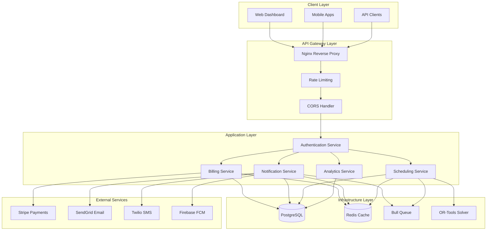

---

## 🗄️ **Database Schema**

### **Core Entity Relationships**

```mermaid
erDiagram
    TENANT ||--o{ SCHOOL : contains
    TENANT ||--o{ USER : belongs_to
    TENANT ||--o{ SUBSCRIPTION : has
    TENANT ||--o{ NOTIFICATION : receives
    
    SCHOOL ||--o{ USER : employs
    SCHOOL ||--o{ SUBJECT : offers
    SCHOOL ||--o{ CLASS : has
    SCHOOL ||--o{ ROOM : contains
    SCHOOL ||--o{ SUBSCRIPTION : subscribes_to
    
    USER ||--o{ NOTIFICATION : receives
    USER ||--o{ NOTIFICATION_PREFERENCE : configures
    USER ||--o{ NOTIFICATION_TEMPLATE : creates
    
    BILLING_PLAN ||--o{ SUBSCRIPTION : defines
    SUBSCRIPTION ||--o{ INVOICE : generates
    SUBSCRIPTION ||--o{ PAYMENT : processes
    SUBSCRIPTION ||--o{ USAGE_METRIC : tracks
    
    NOTIFICATION_TEMPLATE ||--o{ NOTIFICATION : uses
    
    TENANT {
        string id PK
        string name
        string subdomain
        boolean isActive
        datetime createdAt
        datetime updatedAt
    }
    
    SCHOOL {
        string id PK
        string tenantId FK
        string name
        string address
        string phone
        string email
        boolean isActive
    }
    
    USER {
        string id PK
        string tenantId FK
        string schoolId FK
        string email
        string firstName
        string lastName
        enum role
        boolean isActive
    }
    
    BILLING_PLAN {
        string id PK
        string name
        enum type
        decimal monthlyPrice
        decimal yearlyPrice
        json features
        json limits
        boolean isActive
    }
    
    SUBSCRIPTION {
        string id PK
        string tenantId FK
        string schoolId FK
        string planId FK
        enum status
        enum billingCycle
        datetime currentPeriodStart
        datetime currentPeriodEnd
        datetime trialStart
        datetime trialEnd
        string stripeSubscriptionId
    }
    
    INVOICE {
        string id PK
        string subscriptionId FK
        string tenantId FK
        string invoiceNumber
        enum status
        decimal subtotal
        decimal taxAmount
        decimal total
        datetime dueDate
        json lineItems
    }
    
    PAYMENT {
        string id PK
        string subscriptionId FK
        string invoiceId FK
        string tenantId FK
        decimal amount
        enum status
        string paymentMethod
        string stripePaymentId
    }
    
    NOTIFICATION_TEMPLATE {
        string id PK
        string tenantId FK
        string name
        enum type
        string subject
        string content
        json variables
        boolean isActive
        boolean isSystem
    }
    
    NOTIFICATION {
        string id PK
        string tenantId FK
        string templateId FK
        string recipientId FK
        enum type
        enum priority
        enum status
        string subject
        string content
        datetime scheduledFor
        datetime sentAt
        datetime readAt
    }
    
    NOTIFICATION_PREFERENCE {
        string id PK
        string userId FK
        string tenantId FK
        enum notificationType
        enum templateType
        boolean isEnabled
        json deliveryChannels
        string quietHoursStart
        string quietHoursEnd
        string timezone
    }
```

---

## 💳 **Billing System Architecture**

### **Billing Service Layer**

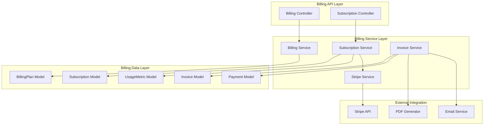

### **Subscription Lifecycle Flow**

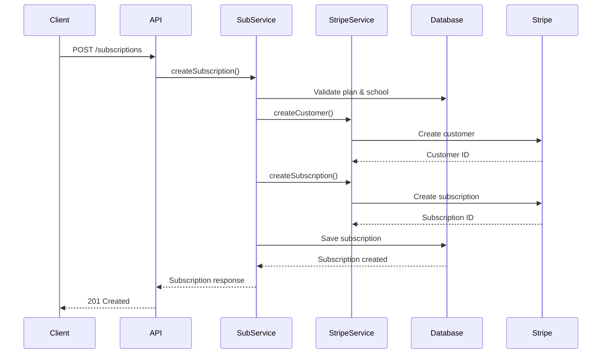

### **Proration Calculation Flow**

```mermaid
graph LR
    START[Plan Change Request] --> VALIDATE[Validate New Plan]
    VALIDATE --> CALC_DAYS[Calculate Remaining Days]
    CALC_DAYS --> CALC_UNUSED[Calculate Unused Amount]
    CALC_UNUSED --> CALC_NEW[Calculate New Amount]
    CALC_NEW --> PRORATION[Proration = New - Unused]
    PRORATION --> UPDATE_STRIPE[Update Stripe Subscription]
    UPDATE_STRIPE --> UPDATE_DB[Update Database]
    UPDATE_DB --> RESPONSE[Return Proration Details]
```

---

## 📱 **Notification System Architecture**

### **Notification Service Layer**

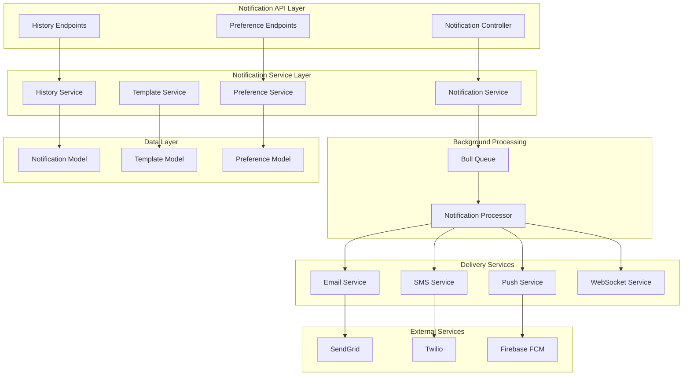

### **Notification Delivery Flow**

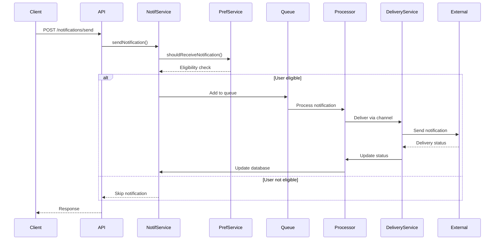

### **Preference Management Flow**

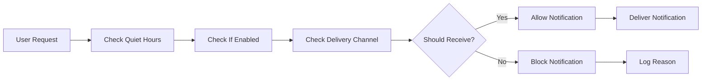

---

## 🔌 **API Layer Architecture**

### **Controller Structure**

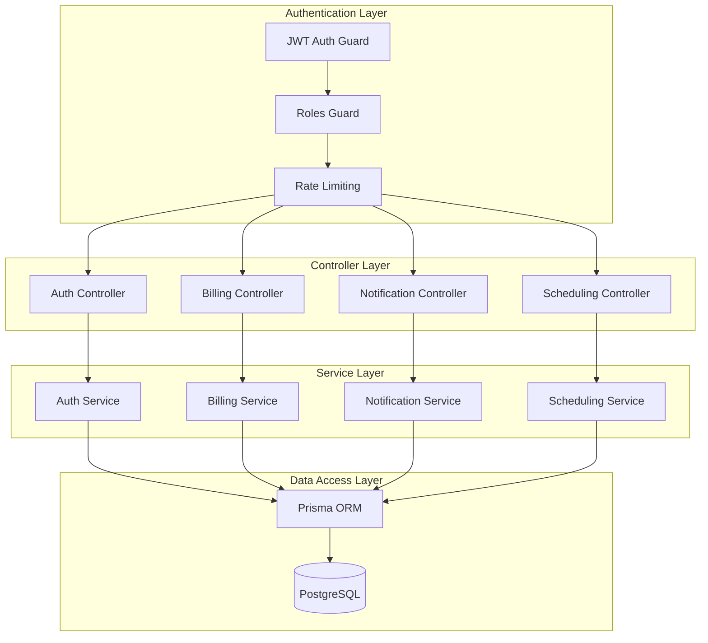

### **API Endpoint Organization**

```
/api/v1/
├── auth/
│   ├── login
│   ├── register
│   ├── refresh
│   └── logout
├── billing/
│   ├── subscriptions/
│   ├── payments/
│   ├── invoices/
│   ├── plans/
│   └── analytics/
├── notifications/
│   ├── send
│   ├── history/
│   ├── preferences/
│   ├── templates/
│   └── admin/
├── scheduling/
│   ├── schedules/
│   ├── sessions/
│   ├── constraints/
│   └── analytics/
└── analytics/
    ├── dashboard
    ├── usage
    └── reports
```

---

## 📊 **Data Flow Diagrams**

### **Billing Data Flow**

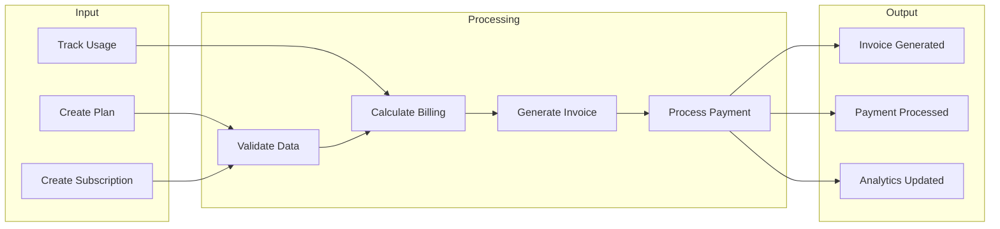

### **Notification Data Flow**

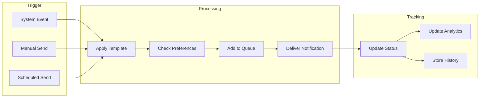

---

## 🔒 **Security Architecture**

### **Authentication & Authorization Flow**

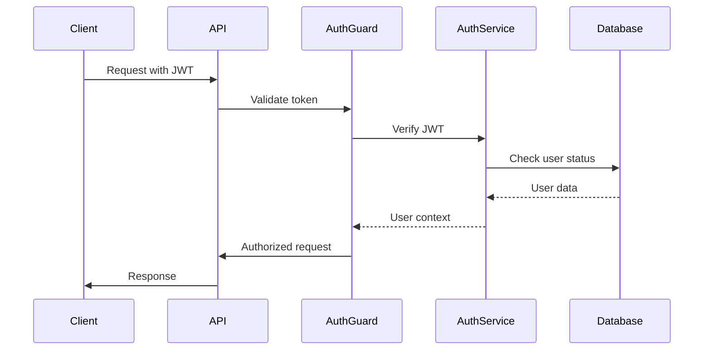

### **Multi-tenant Security**

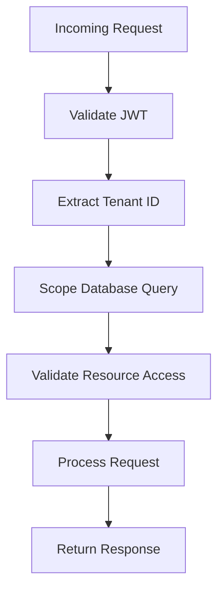

### **Security Layers**

1. **Network Security**
   - HTTPS/TLS encryption
   - CORS configuration
   - Rate limiting

2. **Authentication Security**
   - JWT tokens with expiration
   - Refresh token rotation
   - Password hashing (bcrypt)

3. **Authorization Security**
   - Role-based access control
   - Resource-level permissions
   - Multi-tenant isolation

4. **Data Security**
   - Input validation
   - SQL injection prevention
   - XSS protection

---

## 🚀 **Deployment Architecture**

### **Container Architecture**

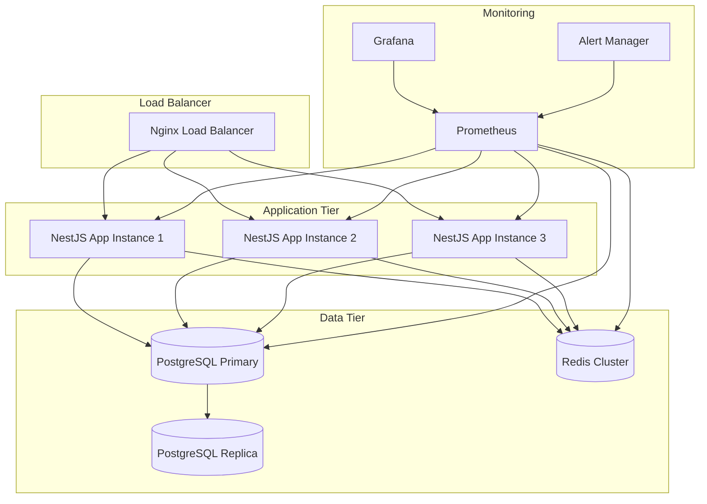

### **Kubernetes Deployment**

```yaml
# Simplified K8s architecture
apiVersion: v1
kind: Namespace
metadata:
  name: sasscolmng
---
# Application Deployment
apiVersion: apps/v1
kind: Deployment
metadata:
  name: sasscolmng-backend
spec:
  replicas: 3
  selector:
    matchLabels:
      app: sasscolmng-backend
  template:
    spec:
      containers:
      - name: backend
        image: sasscolmng/backend:latest
        ports:
        - containerPort: 3000
        env:
        - name: DATABASE_URL
          valueFrom:
            secretKeyRef:
              name: database-secret
              key: url
---
# Service
apiVersion: v1
kind: Service
metadata:
  name: sasscolmng-service
spec:
  selector:
    app: sasscolmng-backend
  ports:
  - port: 80
    targetPort: 3000
  type: LoadBalancer
```

---

## 📈 **Performance Considerations**

### **Scalability Patterns**

1. **Horizontal Scaling**
   - Stateless application design
   - Load balancing across instances
   - Database read replicas

2. **Caching Strategy**
   - Redis for session storage
   - Query result caching
   - Static asset caching

3. **Background Processing**
   - Bull Queue for async tasks
   - Notification processing
   - Report generation

4. **Database Optimization**
   - Proper indexing strategy
   - Connection pooling
   - Query optimization

### **Monitoring & Observability**

1. **Application Metrics**
   - Request/response times
   - Error rates
   - Throughput metrics

2. **Infrastructure Metrics**
   - CPU/Memory usage
   - Database performance
   - Queue processing rates

3. **Business Metrics**
   - User engagement
   - Billing metrics
   - Notification delivery rates

---

This architecture documentation provides a comprehensive overview of the system design, ensuring maintainability, scalability, and security for the SaaS School Management Platform.

