# 🏗️ Architecture Documentation

## 📋 **Table of Contents**
- [System Overview](#system-overview)
- [High-Level Architecture](#high-level-architecture)
- [Database Schema](#database-schema)
- [API Architecture](#api-architecture)
- [Scheduling Engine](#scheduling-engine)
- [Notification System](#notification-system)
- [Security Architecture](#security-architecture)
- [Deployment Architecture](#deployment-architecture)

---

## 🌐 **System Overview**

The SaaS School Management Platform is built using a modern, scalable architecture that supports multi-tenancy, real-time communications, and intelligent scheduling.

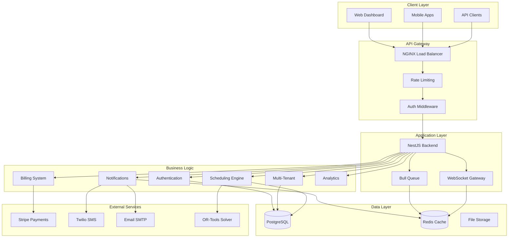

---

## 🏛️ **High-Level Architecture**

### **Layered Architecture**

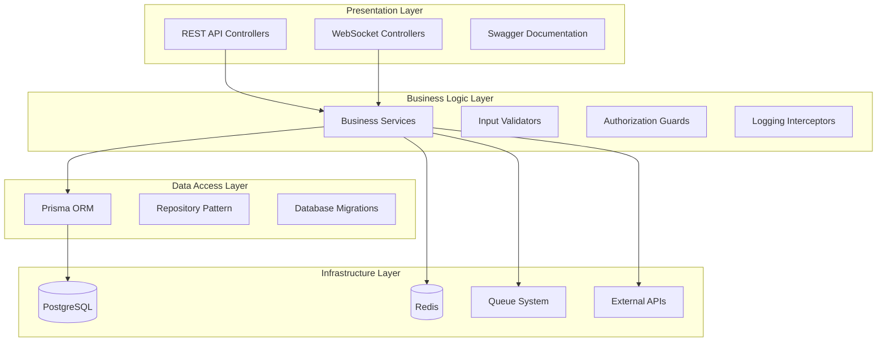

### **Module Architecture**

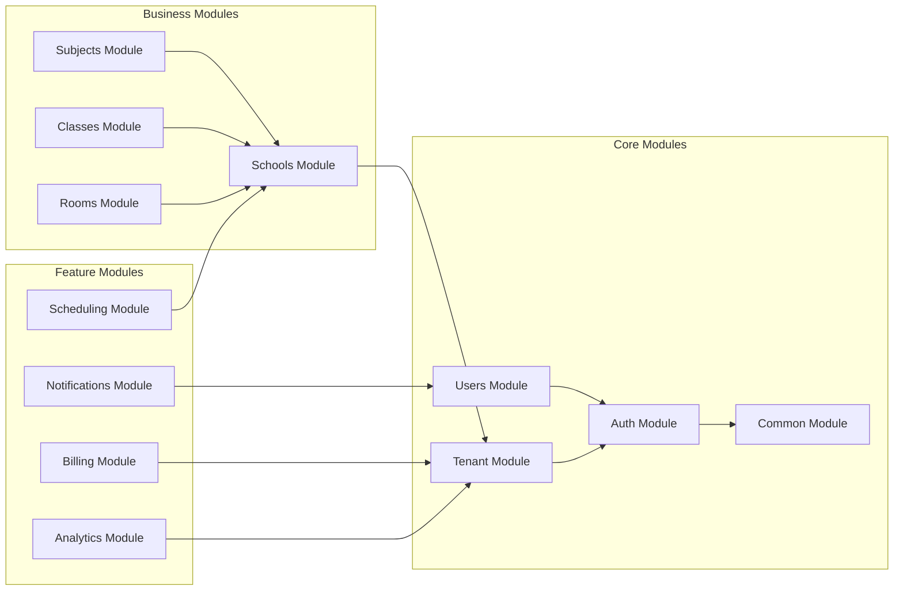

---

## 🗄️ **Database Schema**

### **Core Entities Relationship**

```mermaid
erDiagram
    TENANT ||--o{ SCHOOL : contains
    TENANT ||--o{ USER : belongs_to
    SCHOOL ||--o{ USER : employs
    SCHOOL ||--o{ SUBJECT : offers
    SCHOOL ||--o{ CLASS : has
    SCHOOL ||--o{ ROOM : contains
    SCHOOL ||--o{ SCHEDULE : creates
    
    USER ||--o{ TEACHER_SUBJECT : teaches
    SUBJECT ||--o{ TEACHER_SUBJECT : taught_by
    SUBJECT ||--o{ CLASS_SUBJECT : assigned_to
    CLASS ||--o{ CLASS_SUBJECT : studies
    
    SCHEDULE ||--o{ SCHEDULE_SESSION : contains
    SCHEDULE_SESSION }o--|| SUBJECT : for
    SCHEDULE_SESSION }o--|| CLASS : with
    SCHEDULE_SESSION }o--|| USER : taught_by
    SCHEDULE_SESSION }o--|| ROOM : in
    SCHEDULE_SESSION }o--|| TIME_SLOT : during
    
    SCHEDULE ||--o{ SCHEDULE_CONFLICT : has
    SCHOOL ||--o{ SCHEDULING_PREFERENCE : defines
    SCHOOL ||--o{ SCHEDULING_RULE : enforces
    USER ||--o{ TEACHER_AVAILABILITY : available
```

### **Multi-Tenant Data Isolation**

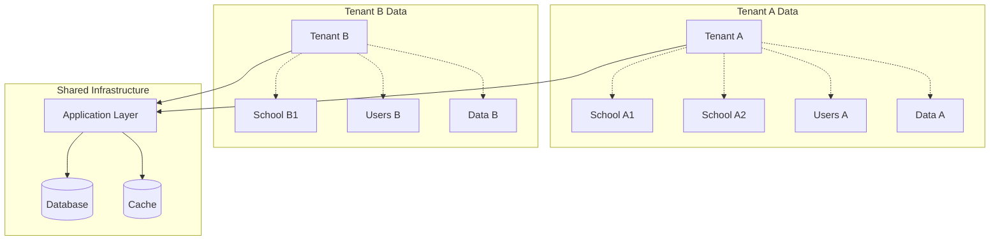

---

## 🔌 **API Architecture**

### **RESTful API Design**

```mermaid
graph TD
    subgraph "API Endpoints"
        AUTH_API[/auth/*]
        TENANT_API[/tenants/*]
        SCHOOL_API[/schools/*]
        USER_API[/users/*]
        SCHEDULE_API[/scheduling/*]
        NOTIFY_API[/notifications/*]
        BILLING_API[/billing/*]
        ANALYTICS_API[/analytics/*]
    end
    
    subgraph "Middleware Stack"
        CORS[CORS Handler]
        HELMET[Security Headers]
        RATE[Rate Limiting]
        AUTH_GUARD[JWT Auth Guard]
        ROLE_GUARD[Role Guard]
        TENANT_GUARD[Tenant Guard]
        VALIDATION[Input Validation]
        LOGGING[Request Logging]
    end
    
    subgraph "Controllers"
        AUTH_CTRL[Auth Controller]
        SCHOOL_CTRL[School Controller]
        SCHEDULE_CTRL[Schedule Controller]
        NOTIFY_CTRL[Notification Controller]
    end
    
    AUTH_API --> CORS
    SCHOOL_API --> CORS
    SCHEDULE_API --> CORS
    NOTIFY_API --> CORS
    
    CORS --> HELMET
    HELMET --> RATE
    RATE --> AUTH_GUARD
    AUTH_GUARD --> ROLE_GUARD
    ROLE_GUARD --> TENANT_GUARD
    TENANT_GUARD --> VALIDATION
    VALIDATION --> LOGGING
    
    LOGGING --> AUTH_CTRL
    LOGGING --> SCHOOL_CTRL
    LOGGING --> SCHEDULE_CTRL
    LOGGING --> NOTIFY_CTRL
```

### **Authentication Flow**

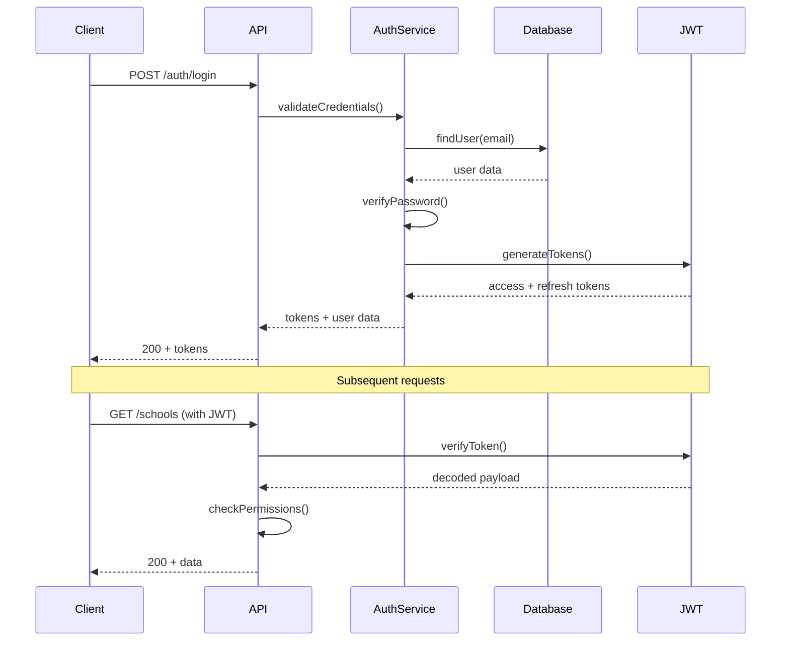

---

## 🧠 **Scheduling Engine**

### **Constraint Programming Architecture**

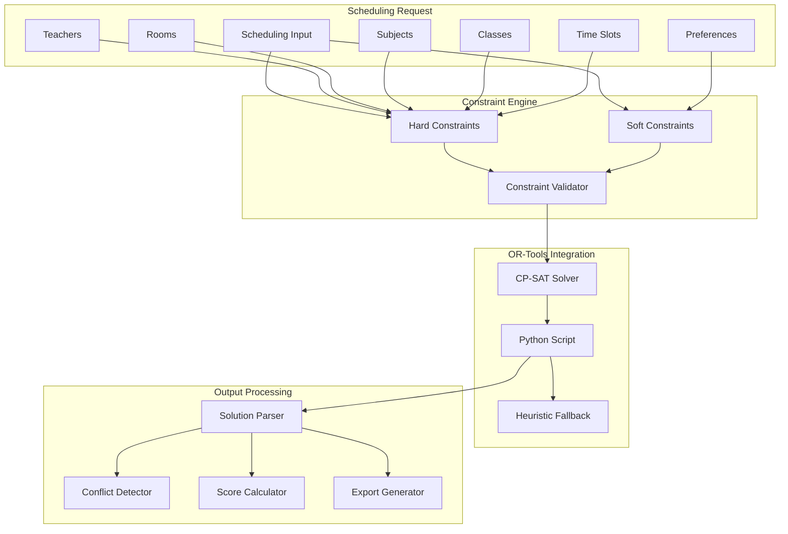

### **Constraint Types**

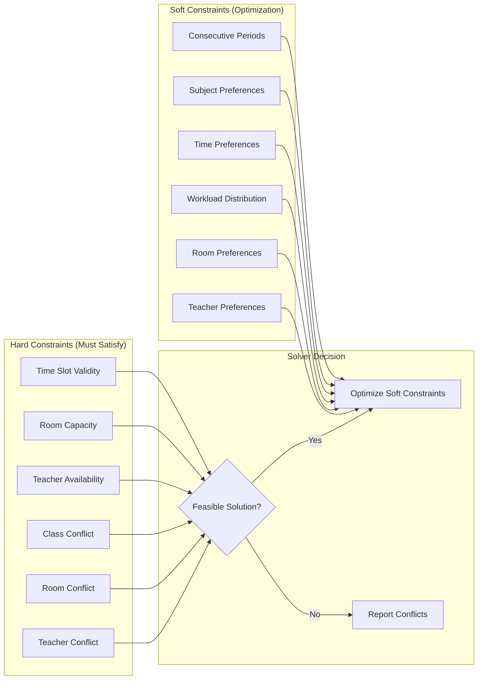

### **Background Job Processing**

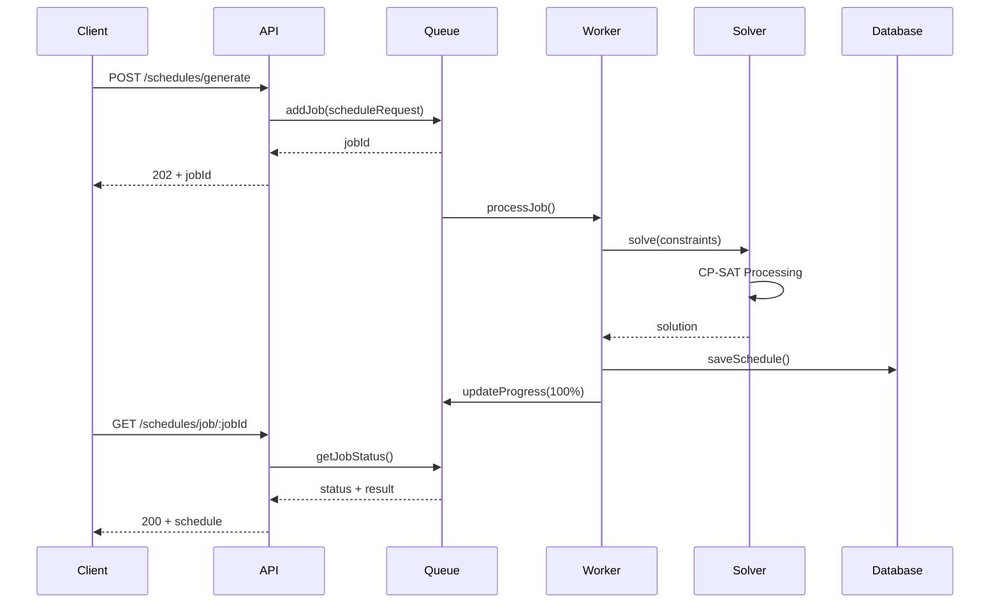

---

## 📢 **Notification System**

### **Multi-Channel Architecture**

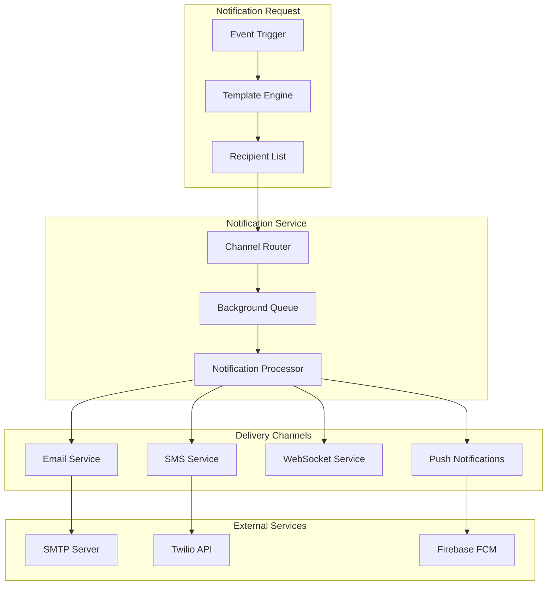

### **Real-time WebSocket Architecture**

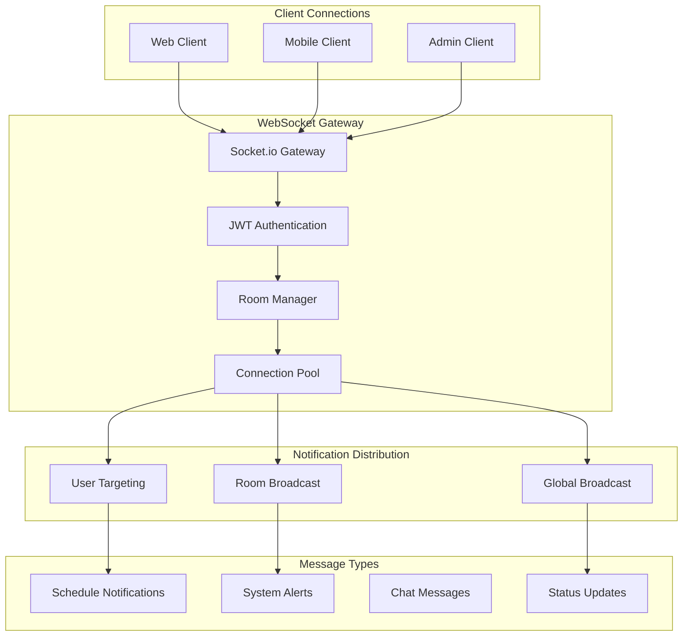

---

## 🔒 **Security Architecture**

### **Authentication & Authorization**

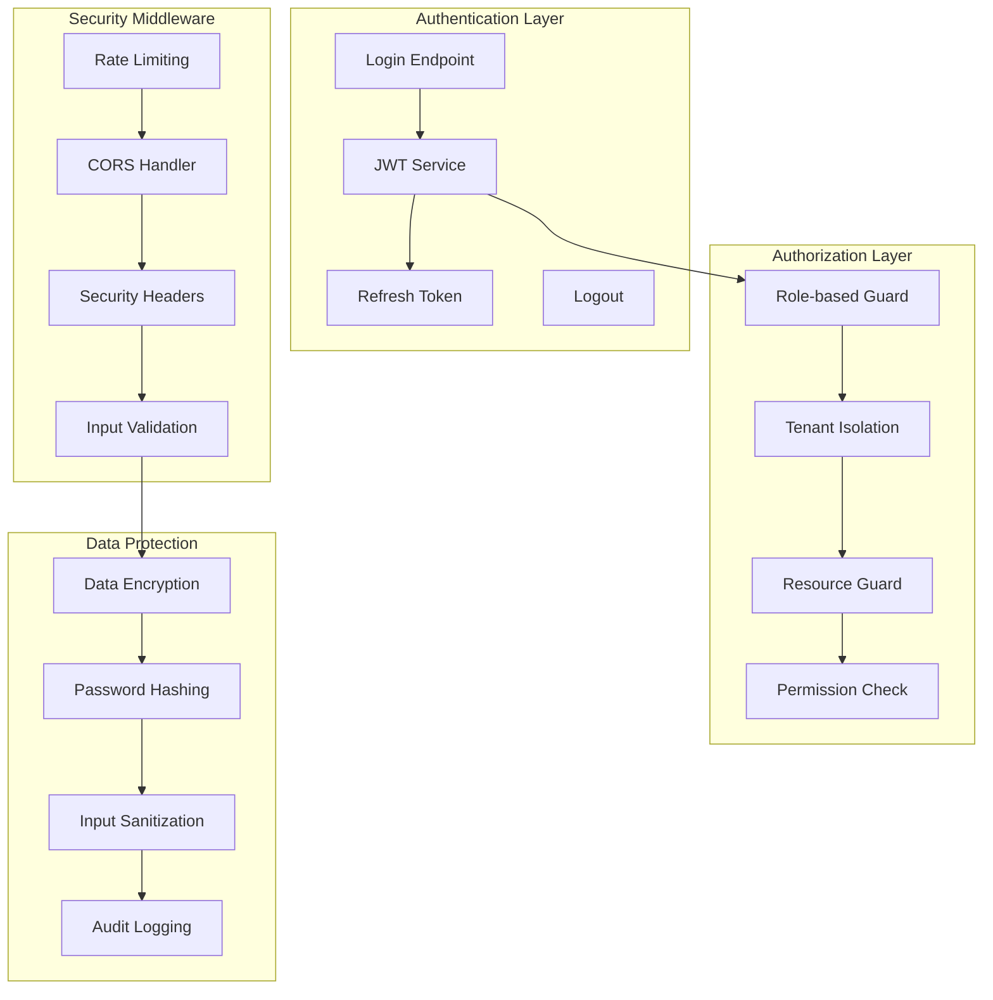

### **Multi-Tenant Security**

```mermaid
graph LR
    subgraph "Request Flow"
        REQUEST[Incoming Request]
        JWT_TOKEN[JWT Token]
        TENANT_ID[Tenant ID]
    end
    
    subgraph "Tenant Isolation"
        TENANT_GUARD[Tenant Guard]
        DATA_FILTER[Data Filtering]
        QUERY_MODIFIER[Query Modifier]
    end
    
    subgraph "Database Access"
        PRISMA_FILTER[Prisma Filter]
        ROW_LEVEL[Row-Level Security]
        TENANT_SCOPE[Tenant Scoping]
    end
    
    REQUEST --> JWT_TOKEN
    JWT_TOKEN --> TENANT_ID
    TENANT_ID --> TENANT_GUARD
    
    TENANT_GUARD --> DATA_FILTER
    DATA_FILTER --> QUERY_MODIFIER
    QUERY_MODIFIER --> PRISMA_FILTER
    
    PRISMA_FILTER --> ROW_LEVEL
    ROW_LEVEL --> TENANT_SCOPE
```

---

## 🚀 **Deployment Architecture**

### **Production Deployment**

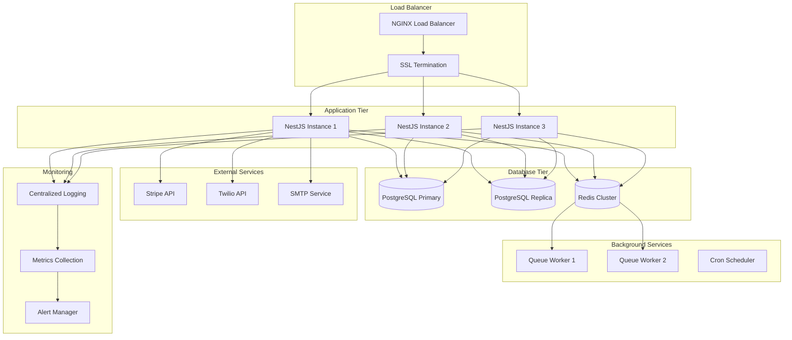

### **Container Architecture**

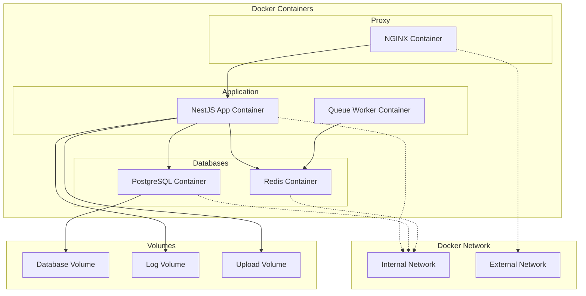

---

## 📊 **Performance Architecture**

### **Caching Strategy**

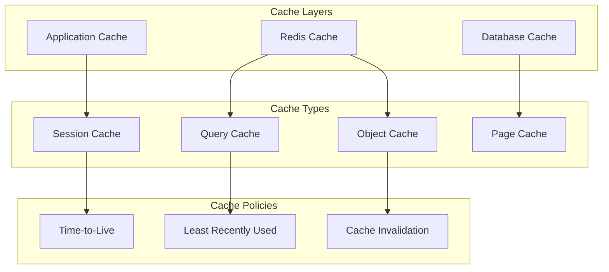

### **Scaling Strategy**

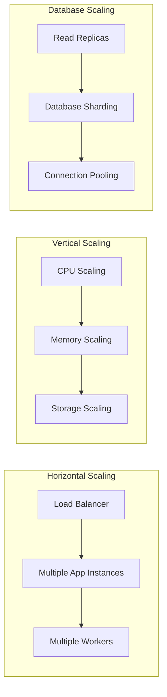

---

This architecture documentation provides a comprehensive overview of the system design, from high-level concepts to detailed implementation patterns. Each diagram illustrates key architectural decisions and their relationships within the overall system.

