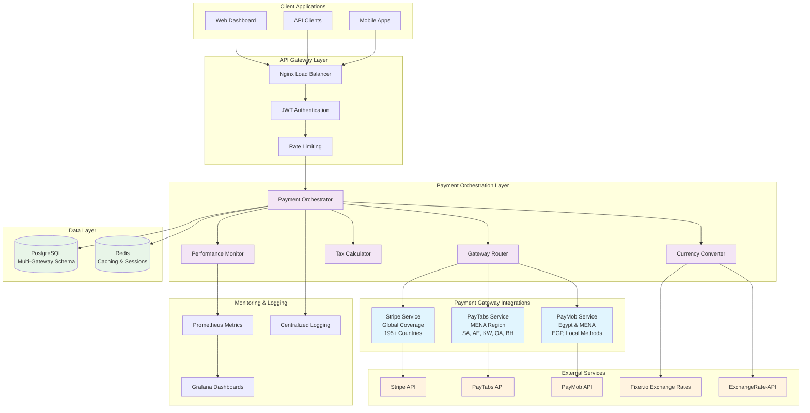
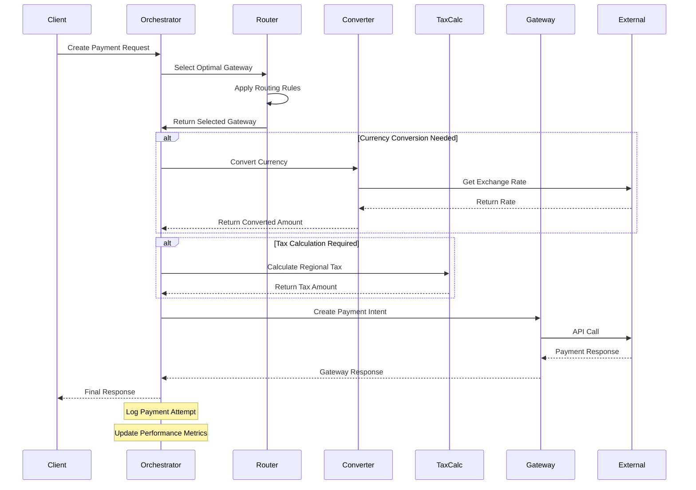
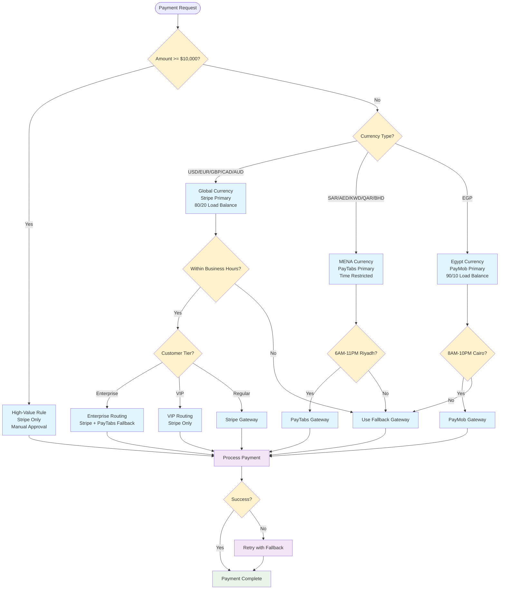
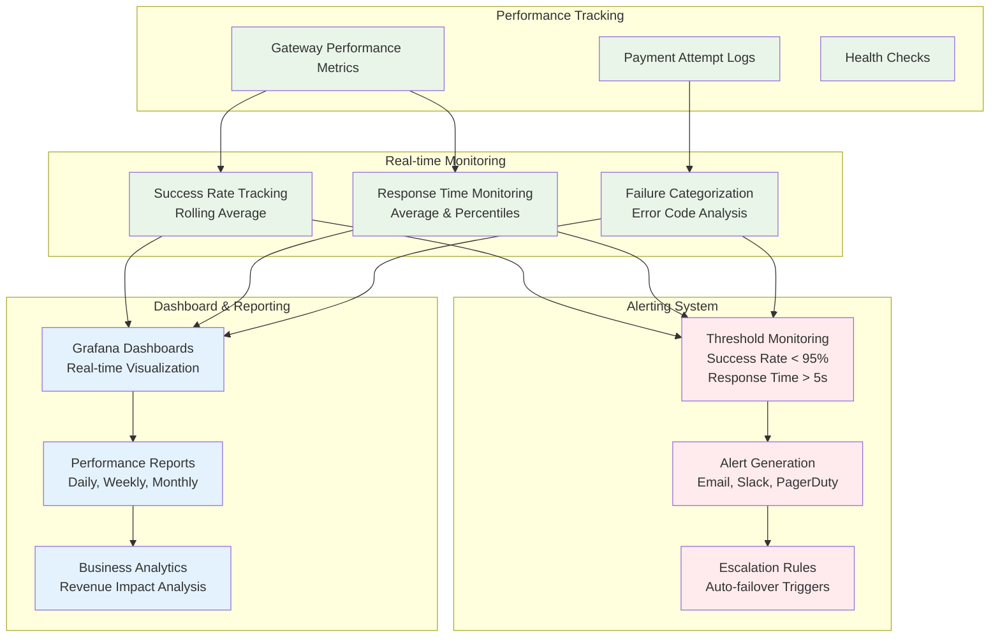
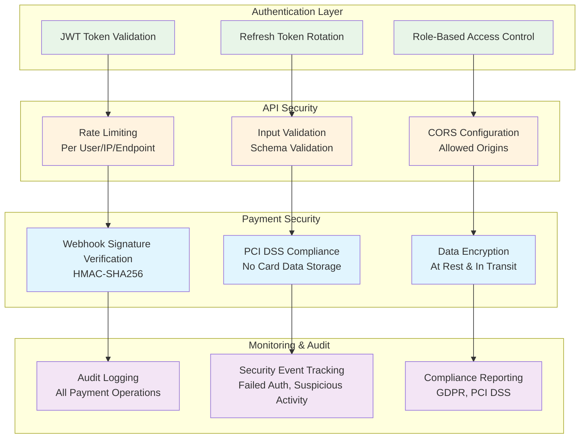
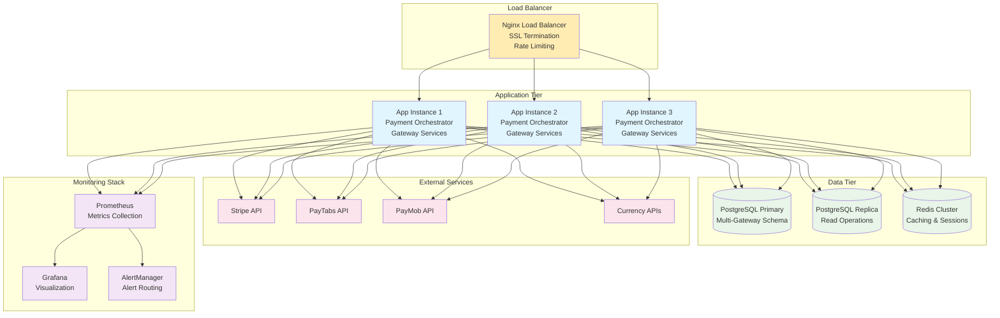

# Multi-Payment Gateway System Architecture

## System Overview

The Multi-Payment Gateway System is designed for global SaaS expansion with intelligent routing, multi-currency support, and regional tax compliance.

## High-Level Architecture



## Payment Flow Architecture



## Gateway Routing Decision Tree



## Multi-Currency Conversion Flow

```mermaid
graph LR
    subgraph "Currency Conversion Process"
        REQ[Payment Request<br/>Amount: $100 USD<br/>Target: EUR] --> CACHE{Check Cache}
        
        CACHE -->|Hit| CACHED[Use Cached Rate<br/>Rate: 0.85<br/>Valid: 45min left]
        CACHE -->|Miss| FETCH[Fetch Fresh Rate]
        
        FETCH --> PROVIDER{Select Provider}
        PROVIDER --> FIXER[Fixer.io API]
        PROVIDER --> EXCHANGE[ExchangeRate-API]
        PROVIDER --> OPEN[Open Exchange Rates]
        
        FIXER --> RATE[Rate: 0.85]
        EXCHANGE --> RATE
        OPEN --> RATE
        
        RATE --> FALLBACK{API Success?}
        FALLBACK -->|No| MANUAL[Use Fallback Rate<br/>Rate: 0.85]
        FALLBACK -->|Yes| CONVERT[Convert Amount]
        MANUAL --> CONVERT
        CACHED --> CONVERT
        
        CONVERT --> CALC[Calculate Fees<br/>Converted: €85.00<br/>Fee: €0.43 (0.5%)<br/>Total: €85.43]
        
        CALC --> STORE[Store in Cache<br/>TTL: 1 hour]
        STORE --> RESULT[Return Result]
    end

    subgraph "Tax Calculation"
        RESULT --> TAX{Tax Required?}
        TAX -->|Yes| REGION[Determine Region<br/>EU: 20% VAT]
        TAX -->|No| FINAL[Final Amount]
        
        REGION --> THRESHOLD{Above Threshold?}
        THRESHOLD -->|Yes| APPLY[Apply Tax<br/>Tax: €17.09<br/>Total: €102.52]
        THRESHOLD -->|No| EXEMPT[Tax Exempt]
        
        APPLY --> FINAL
        EXEMPT --> FINAL
    end

    classDef process fill:#e3f2fd
    classDef decision fill:#fff3e0
    classDef result fill:#e8f5e8
    classDef external fill:#fce4ec

    class REQ,CONVERT,CALC,STORE,REGION,APPLY process
    class CACHE,PROVIDER,FALLBACK,TAX,THRESHOLD decision
    class CACHED,RATE,MANUAL,RESULT,FINAL,EXEMPT result
    class FIXER,EXCHANGE,OPEN external
```

## Database Schema Architecture

```mermaid
erDiagram
    BillingPlan {
        id string PK
        name string
        price integer
        supportedGateways PaymentGateway[]
        gatewaySpecificPricing jsonb
        regionalPricing jsonb
        gatewayMetadata jsonb
    }

    Subscription {
        id string PK
        tenantId string FK
        planId string FK
        paymentGateway PaymentGateway
        gatewaySubscriptionId string
        gatewayCustomerId string
        gatewayMetadata jsonb
        fallbackGateway PaymentGateway
        gatewayMigrationHistory jsonb[]
        status SubscriptionStatus
    }

    Payment {
        id string PK
        tenantId string FK
        subscriptionId string FK
        paymentGateway PaymentGateway
        gatewayPaymentId string
        gatewayTransactionId string
        gatewayMetadata jsonb
        amount integer
        currency string
        originalCurrency string
        originalAmount integer
        exchangeRate decimal
        conversionFee integer
        gatewayFee integer
        status PaymentStatus
    }

    Tenant {
        id string PK
        name string
        customPlans jsonb[]
        preferredGateway PaymentGateway
        gatewayConfigurations jsonb
        billingRegion string
        defaultCurrency string
    }

    PaymentGatewayEnum {
        STRIPE
        PAYTABS
        PAYMOB
    }

    BillingPlan ||--o{ Subscription : "has"
    Tenant ||--o{ Subscription : "owns"
    Subscription ||--o{ Payment : "generates"
    Tenant ||--o{ Payment : "makes"
```

## Performance Monitoring Architecture



## Security Architecture



## Deployment Architecture



## Key Architectural Principles

### 1. **Abstraction & Modularity**
- Common interface (`IPaymentGateway`) for all payment providers
- Pluggable gateway architecture for easy addition of new providers
- Separation of concerns between routing, conversion, and processing

### 2. **Scalability & Performance**
- Horizontal scaling with stateless application instances
- Intelligent caching for exchange rates and gateway performance
- Asynchronous processing for non-critical operations

### 3. **Reliability & Resilience**
- Automatic failover between payment gateways
- Circuit breaker pattern for external API calls
- Comprehensive error handling and retry mechanisms

### 4. **Security & Compliance**
- PCI DSS compliance with no card data storage
- Webhook signature verification for all providers
- Comprehensive audit logging and monitoring

### 5. **Observability & Monitoring**
- Real-time performance metrics and health checks
- Comprehensive logging and alerting
- Business intelligence and analytics integration

This architecture supports global SaaS expansion with enterprise-grade reliability, security, and performance.
